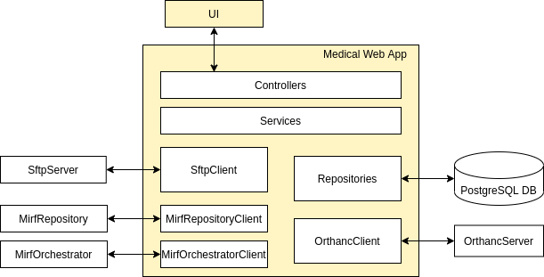

# _Medical Web App_

## Why is it needed?

Automation of medical data processing and correct storage of such data are important tasks today. Automated data processors with built-in machine learning methods are promising tools for detecting abnormalities in medical data. So far only people with programming skills can use them which greatly narrows the target audience. This project is aimed at creating a convenient and simple platform that allows users to store medical data and carry out their automated diagnostics, which can be useful for both doctors and patients. Diagnostics will be carried out using a third-party MIRF framework that contains data processors. Users will be able to upload and store medical images, in particular DICOM files, which will be anonymized before uploading, as well as receive human-readable reports about the results of processing these images. It will also be possible to create a post with a medical question that other users can comment on.

## Key features

- Medical data storage
- DICOM anonymization and processing
- Forum with DICOM attachment preview

## Architecture
(The components with source code located in this repository are highlighted with yellow)

## Requirements for development and contributing
- docker
- docker-compose
- npm
- jdk v11
- maven

## Local deployment

The system is integrated with a bunch of services. The essential ones are SFTP server, PostgreSQL DB, Orthanc server and the MedWebApp itself.

    $ cd <path-to-cloned-repo>/src/main/docker/postgres
    $ docker build -t medwebpostgres .
    $ cd ../../../../med-web-app-front
    $ npm run build
    $ cd ..
    $ docker run -d --name sftp           -p 4999:22   --rm atmoz/sftp  medwebuser:secretpassword:::upload
    $ docker run -d --name medwebpostgres -p 5555:5555 --rm medwebpostgres
    $ docker run -d --name ortanc         -p 8042:8042 --rm jodogne/orthanc
    $ mvn compile jib:dockerBuild
    $ docker-compose up
Four essential containers should be up and running. (You can uncomment other containers in docker-compose.yml but I don't recommend to do it locally)

Open [http://localhost:7999/#/](http://localhost:7999/#/) to view it in the browser.

